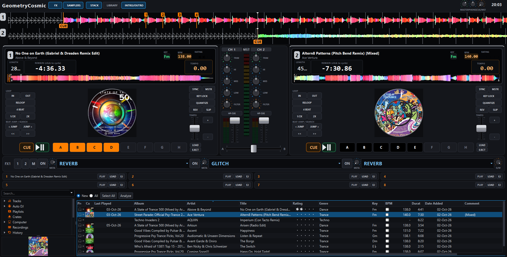
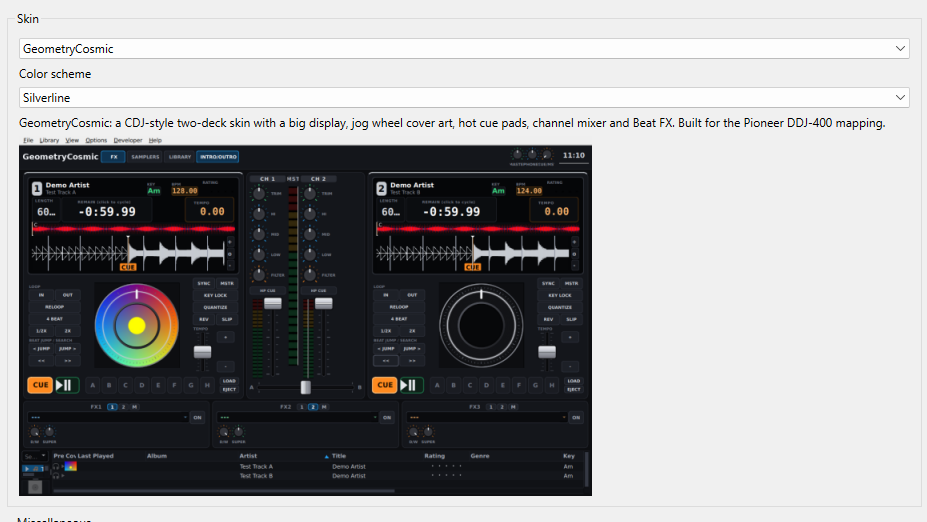
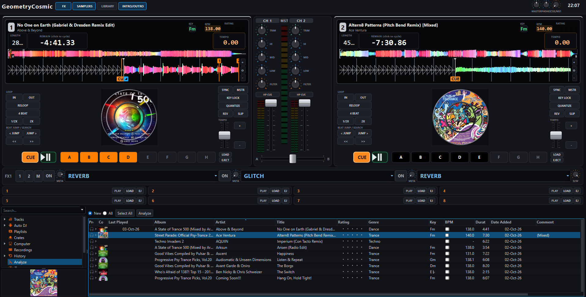

# GeometryCosmic Mixxx Skins V1.2 (New WaveStack)

Two dark, CDJ-style skins for Mixxx DJ software, built around the Pioneer DDJ-400 DDJ-FLX4 mapping: a full-size skin and a compact one for 7" (1024x600) touch screens.

## Included Skins V1.2
-New Stacked waveforms, both scrolling waveforms sit on top of each other (deck 1 above deck 2) Each deck keeps its own overview strip. Toggle with the **STACK** button in the toolbar.

### GeometryCosmic (full size)
- Big track display, jog wheel with cover art, hot cue pads, loop and beat-jump controls.
- Channel mixer with EQ, filter, VU meters and crossfader.
- Three Beat FX boxes, each with an effect selector, ON button, deck assign (1 / 2 / M), a META knob and a dry/wet knob.
- Full library view, samplers and intro/outro cues from the top bar.
- Color schemes: **Silverline** and **BlueOrange**.

### GeometryCosmic-7 (7" screens)
- Compact two-deck layout for 1024x600.
- A single wide Beat FX bar (the DDJ-400 DDJ-FLX4 drives one effect unit): 3 effect slots, each with an OFF button, META knob and selector, plus one dry/wet knob.
- A LIBRARY button in the top bar opens the full library.
- No color schemes.

## FX knobs
- **LEVEL/DEPTH**: moves the dry/wet knob.
- **SHIFT + LEVEL/DEPTH**: moves the META knob of the focused effect.

## Installation
Copy both `GeometryCosmic` and `GeometryCosmic-7` into your Mixxx skins folder:
- **Windows**: `C:\Users\<YourUsername>\AppData\Local\Mixxx\skins\`
- **Linux / Raspberry Pi**: `~/.mixxx/skins/`

### Installation via Terminal / SSH (Linux & Raspberry Pi)

To install or update both skins directly to your Mixxx directory, open your terminal (or SSH into your Pi) and run:

mkdir -p ~/.mixxx/skins && cd ~/.mixxx/skins && git clone https://github.com/djayza/GeometryCosmic-Mixxx-Skins.git temp_skins && cp -r temp_skins/GeometryCosmic temp_skins/GeometryCosmic-7 . && rm -rf temp_skins

Then in Mixxx go to **Options ➔ Preferences ➔ Interface** and pick the skin. Press `Ctrl + Shift + R` to reload a skin without restarting.

## Notes
- Tested with: Mixxx <version>, DDJ-400 DDJ-FLX4.
- Other controllers work, but the FX labels assume the DDJ-400 layout.

## License
<GPL-2.0>
